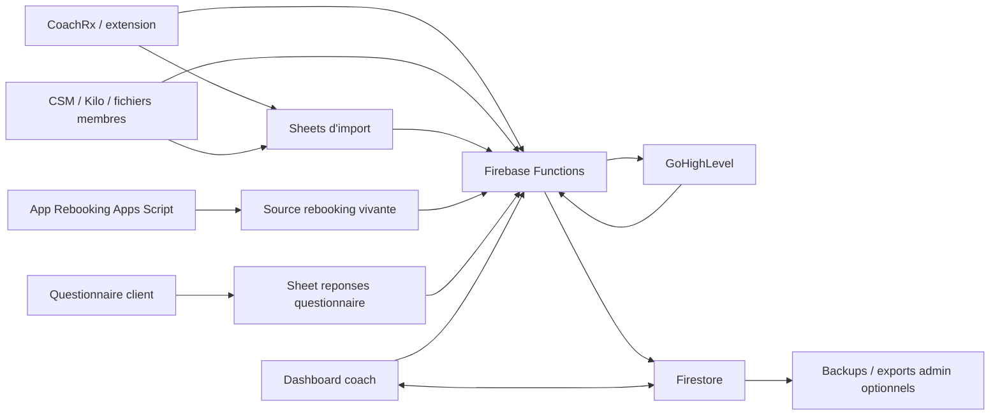

# Plan operationnel des donnees - Dashboard Coach CFSB

Derniere mise a jour: 2026-06-09

## Objectif

Rendre le Dashboard Coach rapide, interactif et fiable, sans obliger les coachs a travailler dans plusieurs fichiers. Les sources historiques peuvent continuer d'exister, mais le dashboard doit toujours savoir:

- quelle source contient la donnee;
- ou la donnee est stockee pour l'app;
- qui peut la modifier;
- si une synchronisation peut l'ecraser;
- comment voir si la donnee est fraiche ou douteuse.

## Decision recommandee

Firestore doit etre la base operationnelle du dashboard.

Google Sheets, Apps Script, CoachRx, CSM, Kilo et GHL restent des sources, des ponts ou des backups. Ils alimentent Firestore, mais l'interface coach doit lire Firestore pour rester rapide.

La destination cible des donnees vivantes est Firestore. Un script qui extrait deja des donnees fiables peut ecrire directement dans Firestore via Cloud Function protegee, sans devoir creer ou mettre a jour un Google Sheet intermediaire.

Le registre officiel des sources est `firebase-dashboard/SOURCE_REGISTRY.json`. Avant de brancher une source, il faut y identifier le domaine de donnee, la source operationnelle, les sources temporaires, la collection Firestore cible et la regle de conflit.

Le plan d'execution technique est `firebase-dashboard/DATA_INGESTION_PLAN.md`. Il transforme le registre en contrats source par source et precise l'ordre recommande: CoachRx, repertoire client/CSM, GHL, questionnaire, rebooking, puis check-ups.

La cadence de fiabilite, d'adoption, de publication et d'analyse des automatisations est definie dans `firebase-dashboard/PRODUCT_OPERATING_SYSTEM.md`.

Les Google Sheets restent pertinents quand ils sont:

- la vraie source historique, comme certains formulaires;
- un registre admin que Michael veut pouvoir inspecter;
- un backup lisible;
- un outil de reconciliation temporaire.

Ils ne doivent pas etre ajoutes simplement parce que le dashboard en avait besoin au debut.

## Pourquoi ne pas tout faire dans Google Sheets

Google Sheets est excellent pour:

- importer;
- verifier;
- corriger ponctuellement;
- garder un backup lisible;
- travailler cote admin.

Mais il est fragile comme moteur principal d'une app coach:

- les clics attendent Apps Script;
- les operations simultanees peuvent etre lentes;
- les permissions sont moins fines;
- les actions coach sont plus difficiles a journaliser proprement;
- les doublons apparaissent vite si plusieurs scripts ecrivent dans plusieurs fichiers.

## Pourquoi garder Firebase

Firestore/Firebase est mieux adapte pour:

- afficher rapidement les onglets;
- donner un retour instantane aux coachs;
- gerer les permissions par utilisateur;
- conserver les actions coach;
- lire/ecrire des petits documents;
- synchroniser en arriere-plan;
- eviter de bloquer l'interface pendant les imports.

## Architecture cible

## Regle centrale

Une information creee ou decidee dans le dashboard doit d'abord etre ecrite dans Firestore.

Ensuite, elle peut etre copiee vers Google Sheets ou GHL si on veut un backup ou une trace externe.

Exemples:

- note coach: Firestore d'abord, copie GHL optionnelle;
- tache creee par un coach: Firestore d'abord;
- statut rebooking traite dans le dashboard: Firestore d'abord, puis reconciliation avec la source rebooking si necessaire;
- risque coach manuel: Firestore d'abord;
- impact: Firestore d'abord.

## Regles par type de donnee

| Donnee | Source primaire cible | Source temporaire actuelle | Ecriture coach | Peut etre ecrasee par sync? | Commentaire |
| --- | --- | --- | --- | --- | --- |
| Acces utilisateur | Firebase Auth + `users` | Firestore | Admin seulement | Non | Chaque coach doit avoir son propre courriel/acces. |
| Liste coachs | Firestore `coaches` | seed/code + admin | Admin seulement | Non sauf seed controle | CoachRx ID officiel obligatoire. |
| Relation coach-client | Firestore, alimente par CoachRx/CSM | `SRC_CoachRx_Browser_All`, `CORE_Clients` | Admin/coach selon regle | Oui, mais avec garde-fous | Le telephone gagne sur le nom pour dedupliquer. |
| Telephone client | Source membre fiable + GHL | `CORE_Clients`, `CORE_Clients_Manual`, GHL enrichissement | Admin/coach peut corriger | Une valeur vide ne remplace jamais une valeur existante | Source critique pour questionnaire/GHL. |
| Membership actif | Source CSM/Kilo si disponible | `CORE_Clients` | Admin/coach peut corriger | Oui pour libelle, non pour champs manuels | La fin membership reste manuelle. |
| Fin membership manuelle | Firestore | Dashboard | Coach/admin | Non | Jamais calculee automatiquement. |
| Recurrence prevue Kilo | Firestore | Dashboard | Coach/admin | Non | Champ manuel. |
| Notes/objectifs coach | Firestore | Dashboard | Coach/admin | Non | Peut etre copie vers GHL en backup. |
| Risque coach manuel | Firestore | Dashboard | Coach/admin | Non, sauf proposition non destructive du questionnaire | Le coach garde le dernier mot. |
| Reponses questionnaire | Firestore, alimente par questionnaire | Sheet `Responses` / `Test_Responses` | Lecture/archivage par coach | Non pour contenu; oui pour nouvelles reponses | Matching par telephone. |
| Envoi questionnaire | Firestore + GHL | `questionnaireSends` | Coach | Non | La tentative doit toujours etre journalisee. |
| To-do | Firestore | `TASKS_Current` + questionnaire | Coach/admin | Sync peut ajouter, pas ecraser les actions fermees | `TASKS_Current` doit devenir temporaire, pas source primaire. |
| Rebooking | Firestore, alimente par source rebooking vivante | `SRC_Rebookings_SemiPrive` | Coach/admin | Non si deja traite | Il faut confirmer que la source actuelle est bien celle de l'app Apps Script. |
| Check-ups | Firestore, alimente par CSM | Sheet CSM `Formulaire Checkup` | Lecture dashboard | Oui, import seulement | Sert surtout a Performance/historique. |
| Impacts | Firestore | `IMPACT_Log` / `IMPACT_Opportunities` | Coach/admin | Non | Firestore devrait devenir source primaire. |
| Alumni | Firestore | `CORE_Alumni` | Coach/admin | Non sur decisions coach | Priorite secondaire pour pilote. |
| Journal d'action | Firestore `actionLogs` | aucun | System/dashboard | Jamais | Append-only. |

## Strategie de synchronisation

### Lecture rapide

Le dashboard lit Firestore seulement. Il ne doit pas attendre Google Sheets ou Apps Script pendant qu'un coach navigue entre les onglets.

### Mise a jour manuelle

Le bouton `Synchroniser` doit:

1. lire les sources officielles;
2. normaliser les donnees;
3. matcher par telephone, puis ID source, puis nom;
4. ecrire dans Firestore;
5. produire un diagnostic visible.

### Mise a jour planifiee

Une sync planifiee peut rouler aux 6 heures ou selon le besoin. Elle doit utiliser le meme moteur que le bouton manuel.

### Synchronisation quasi temps reel

Pas obligatoire au depart. Pour le pilote, une donnee valide apres quelques minutes ou apres clic `Synchroniser` est acceptable, tant que:

- l'interface reste rapide;
- le coach voit la fraicheur des donnees;
- les actions faites dans le dashboard sont instantanees.

### Sources directes par script

Quand un script Apps Script extrait deja une source vivante, le chemin recommande est:

1. extraire la source;
2. normaliser au minimum les champs critiques, surtout telephone, nom client, coach et ID source;
3. envoyer un payload a `ingestDashboardSource`;
4. laisser Firebase dedupliquer et proteger les champs manuels;
5. garder un journal `sourceImportRuns`.

Le script peut encore ecrire dans un Sheet en parallele si on veut une preuve ou un backup, mais Firestore devient la base utilisee par le dashboard.

Les imports directs ne se comportent pas tous de la meme facon:

- `coachrx_clients` et `client_directory` peuvent representer un snapshot complet. Dans ce cas, un client importe precedemment par la meme famille de source et absent du dernier snapshot peut etre marque `import_stale`.
- `ghl_contacts` est un enrichissement partiel. Il peut ajouter ou confirmer telephone/courriel, mais ne doit jamais marquer un client absent comme inactif ou perime.
- Les clients crees manuellement, les champs manuels et les documents lies a une correction humaine sont toujours proteges contre ce nettoyage.

### Bob Operator

Bob Operator est utile pour travailler sur les scripts Google Workspace et leurs deploiements. Son role cible est:

- retrouver les projets Apps Script pertinents;
- inspecter leur code et leurs declencheurs;
- ajouter un pont vers Firebase;
- configurer ou verifier les Script Properties;
- produire une trace de changement.

Bob ne doit pas devenir une nouvelle base de donnees. Il aide a connecter les sources existantes a Firebase.

### GoHighLevel

GHL est probablement la meilleure source externe pour enrichir les telephones et confirmer l'existence d'un contact, mais il doit etre appele cote serveur seulement:

- jamais depuis GitHub Pages ou le navigateur du coach;
- jamais avec un token dans un fichier public;
- via Firebase Functions ou un Apps Script prive;
- avec journalisation des erreurs de matching.

## Regles anti-doublons

1. Le telephone normalise est la cle principale quand il existe.
2. L'ID source gagne sur le nom si le telephone manque.
3. Le nom seul est un dernier recours.
4. Une fiche manuelle ne doit pas etre dupliquee si CoachRx retrouve le meme client plus tard.
5. Une valeur vide importee ne doit jamais effacer une valeur utile.
6. Une decision coach ne doit pas etre ecrasee par un import.
7. Les transferts de coach doivent garder l'historique.
8. Un import GHL ne doit jamais supprimer, archiver ou perimer un client; GHL sert seulement a enrichir et confirmer.

## Regles de conflit

| Situation | Regle |
| --- | --- |
| Source externe dit telephone vide, Firestore a un telephone | Garder Firestore. |
| Source externe donne nouveau telephone, Firestore telephone vide | Importer. |
| Source externe donne nouveau telephone different | Marquer a valider, ne pas remplacer silencieusement. |
| Coach change risque manuel | Garder le risque manuel. Questionnaire peut proposer, pas forcer. |
| Rebooking deja gere dans Firestore, source le remet ouvert | Garder le statut Firestore et afficher conflit si necessaire. |
| Client change de coach | Transferer la fiche, garder notes, historique, questionnaires, rebooking, impacts. |
| Questionnaire avec telephone reconnu mais coach different | Classer en validation, ne pas perdre. |
| Questionnaire sans client reconnu | File `A valider`. |

## Gouvernance d'ecriture par domaine

Le registre machine-readable `SOURCE_REGISTRY.json` contient maintenant `domainGovernance`. Cette section evite qu'une nouvelle source ecrive une donnee sans savoir qui gagne, ce qui peut etre ecrase et ou envoyer les conflits.

| Domaine | Writer primaire | Writers secondaires permis | Ecrasement permis | Preuve de fraicheur |
| --- | --- | --- | --- | --- |
| Acces coach | Firebase Auth + `users` | Auto-activation pilote approuvee | Non | `users`, `coaches`, `actionLogs` |
| Client / coach responsable | Firestore `clients` fusionne | CoachRx, repertoire client, correction admin | Seulement champs importes non manuels | `sourceImportRuns`, `coachSyncStatus`, `clients.updatedAt` |
| Telephone client | Repertoire fiable ou GHL serveur | `client_directory`, `ghl_contacts`, correction manuelle | Seulement si Firestore est vide; conflit = validation | `phoneSource`, `phoneUpdatedAt`, `sourceImportRuns` |
| To-do | Firestore `tasks` | Note coach, questionnaire, rebooking, transition `TASKS_Current` | Ajout seulement; jamais reouvrir une action fermee | `sourceType`, `sourceEventId`, `actionLogs` |
| Reponses questionnaire | Endpoint questionnaire / import | Lecture coach, creation mission | Contenu immutable | `receivedAt`, `questionnaireSends`, `sourceImportRuns` |
| Envoi questionnaire | Cloud Function `sendQuestionnaire` | Statut serveur GHL | Append/journal seulement | `questionnaireSends`, `actionLogs`, erreurs GHL |
| Rebooking | Firestore apres parite legacy | Import AUTO-003, action coach | Import ouvert ne reouvre jamais un item traite | `sourceEventId`, `sourceImportRuns`, compteurs legacy |
| Check-ups | Import CSM | Aggregation Performance | Meme evenement seulement; jamais champs manuels client | `checkups.submittedAt`, `sourceImportRuns` |
| Impacts | Workflow dashboard | Import historique explicite | Non; changement journalise | `impacts.updatedAt`, `actionLogs` |
| Alumni | Workflow dashboard | Import admin | Ne pas ecraser decisions coach | `alumni.updatedAt`, `actionLogs` |

Regle pratique: si une source ne sait pas fournir une preuve de fraicheur et une destination de conflit, elle peut etre lue en preview, mais elle ne devrait pas ecrire en production.

## Diagnostic a afficher dans le dashboard

Chaque coach devrait avoir un etat simple:

- derniere sync;
- source clients;
- clients sans telephone;
- source rebooking;
- rebookings non relies;
- reponses questionnaire non matchees;
- To-do importees vs To-do creees dans Firebase.

Le but n'est pas d'exposer toute la plomberie au coach, mais de permettre a l'admin de comprendre rapidement pourquoi une donnee semble fausse.

## Solutions possibles

### Option A - Google Sheets comme moteur principal

Avantage: familier, facile a inspecter.

Probleme: lent, fragile, moins interactif.

Verdict: pas recommande comme app finale.

### Option B - Firebase comme base unique immediate

Avantage: propre, rapide.

Probleme: migration plus longue; il faut brancher toutes les sources directement.

Verdict: bon objectif long terme, mais trop brusque pour le pilote.

### Option C - Hybride controle

Firebase est la base operationnelle. Sheets et Apps Script restent sources/backups pendant la transition.

Verdict: meilleure option pour CFSB maintenant.

## Plan d'execution recommande

### Phase 1 - Stabiliser les sources

1. Confirmer le Sheet source officiel des clients actifs et telephones.
2. Confirmer si `SRC_Rebookings_SemiPrive` est vraiment alimente par l'app Apps Script rebooking actuelle.
3. Confirmer comment `TASKS_Current` est genere.
4. Documenter les onglets qui sont sources primaires vs miroirs.

### Phase 2 - Corriger Firebase Sync

1. Brancher la vraie source telephone.
2. Importer les rebookings depuis la source vivante.
3. Reduire la dependance a `TASKS_Current`.
4. Ajouter diagnostics par source.
5. Garder les actions fermees et manuelles non ecrasees.

### Phase 3 - Rendre le dashboard actionnable

1. To-do fiable.
2. Questionnaire avec filtres utiles et missions creees depuis une reponse.
3. Rebooking coherent avec l'app historique.
4. Fiche client comme centre d'information.
5. Performance basee sur check-ups, impacts et clients fiables.

### Phase 4 - Backup et resilience

1. Copier notes importantes vers GHL si souhaite.
2. Exporter Firestore vers Google Sheets admin si necessaire.
3. Garder Apps Script comme filet de securite jusqu'a validation.
4. Ajouter procedures de rollback.

## Decision pratique pour maintenant

Le prochain gros bloc de travail devrait etre:

1. auditer les sources vivantes exactes;
2. corriger les branchements clients/telephones/rebooking;
3. ajouter un diagnostic source visible dans le Guide;
4. seulement ensuite retravailler l'UX des onglets avec confiance.

Si on saute cette etape, on risque de polir une interface qui affiche encore des donnees incompletes.
